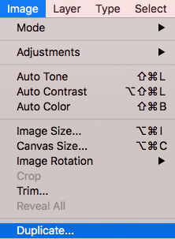

# Photoshop for Beginners Activity #2: Basic Photo Edits
Let’s move on using Photoshop and do some basic edits to a photo. If you have any questions, please ask!

1. [Download this image for the exercise](https://unsplash.com/photos/xEX_o0haX6c){:target="_blank"} 

2. Open the photo in Photoshop by either clicking on the **Open button** or going to **File -> Open**. Find where you saved the photo and open it. If your browser automatically saved it for you, it is probably in your **Downloads** folder. 
 
3. We are first going to make a copy of this image before we edit it so that we keep a copy of our original. To do this, click on Image in the top menu and then click on Duplicate. This will bring up a small window with the option to give the new copy a new name. It will save it to the same folder where the original is saved. Don’t worry about adding .jpg to the end of the file as this will be added for you. You will now see above your image that you have two tabs open in Photoshop with the names of the two files. Make sure you are working in the one you plan to resize. You can close the original to avoid confusion.
 
 

4. **Converting to Black and White:**
 
  - Click on **Layer** in the top menu (see right), then **New Adjustment Layer**, and then **Black & White**. A small window will pop up. Click **OK**.
 
  - A new layer called Black & White 1 will appear in your Layers window on the right. It will sit above your Background layer (original image). Double click on the little two-tone rectangle in the left side of the Black & White layer: This will bring up the Properties of that layer. Note: if you click on different parts of the layer, it will bring up different menus to edit for that layer. If your Layers window disappears, you can find it again by going to Window in the very top menu.
 
  - In the Properties for the Black & White adjustment layer, there is a series of sliders that enable you to adjust the brightness for each of the tones in the image individually, giving you greater control. Try dragging some of them to see what happens.
  - Next, Click on **Layer** in the top main menu (see right), then **New Adjustment Layer**, and then **Curves**. A small window will pop up. Click **OK**.
Go into the **Curves** layer properties. Click on the diagonal line in three places to **create three evenly spaced round handles** (see first image to the right). Once the handles are there, you can grab them with your mouse and **drag them up or down** to make adjustments in your photo. The wave form in the back shows the lights and darks in your image. To the left of the waveform are the darks and the right side displays the lights. In the example screenshot, the diagonal Curve line has been dragged to give an upwards bump to the brights and a downwards bump to the darks, which is a way to slightly increase the contrast of the image, if needed.  
 
 

5. **Save**:   
  - Whenever you see the asterisk to the right of the file name up in the upper left corner of the screen, this is an indication that you’ve made a change to your file and have not saved it.
 
  - Click on **File -> Save As** in the upper left corner. We are going to save this in the Photoshop .psd format, which will preserve the layers for the project we are working on, and not touch the original photo. Choose where you would like to save the file, and give it a name you will remember. Make sure **Layers** is checked. Click **Save**. And then click **OK**.
 
6. **Heal Tool**: Next we will use **Heal** to remove the visible screws in the post.
  - You will most likely have a bandage icon (**Heal or Spot Heal tool**) showing in the left toolbar. If you **right click** on the tool, it will bring up the list of available tools in that group. Click on the **Spot Healing Brush** tool to select it. Make sure the image (Background) layer is the one selected in the Layers Panel.\
  - Once selected, a menu at the top left-to-centre of the software will be there with specific options for that tool. In the example here, the round, white dot with the number 19 below indicates that the brush shape of the Spot Healing tool is round and solid, and 19 pixels in size. Click on the **downward arrow** right next to it, and adjust the **Size to 25**. 
 
  - Note: You will need to make sure that the Background layer is selected: go to **Layers** window to make sure you are working in the correct layer before making Healing Tool edits.
  - You might find it helpful to zoom in before healing. To zoom in to an area in your photo, **click on the Zoom button** (magnifying glass icon) at the bottom of the left toolbar and then click in the area you want to zoom. If you want to adjust where the image is sitting, you can **click on the Hand tool** (hand icon) right above the Zoom tool. If you’ve zoomed in too far, you can click on the **Zoom Out** button at the top left of the screen which will turn your Zoom tool into a Zoom Out tool and you can click on your image to zoom out. Once the image is in a comfortable position, you will need to **click back on the Spot Healing Brush tool again**. Use your left mouse button to **draw over the screw**. Go ahead and clean up the blemish right above it too. See to the right for a before and after.  Optionally, use the Spot Healing Brush to remove the screw at the base of the pole. 
  
   
  - Use the **Zoom tool** to zoom back out to see the whole photo. 
Click on **File -> Save** to save your recent changes.
7. **Exporting**:
  - To export this to a full size PNG file, click on **File -> Export As** in the upper left corner. A window will pop up with options for resizing. Leave image size and quality at 100%,  but make sure the **Format** is set to **PNG** in the dropdown in the upper right corner of the Export window. Click the **Export All** button in the bottom corner when ready. Another small window will pop up giving you an option to choose a save location. Choose a place on your computer to save the file and click Save.

You will now have your original unedited photo, an edited .PSD file that has layers you can go back and edit more, and a PNGfile that is ready to print. If you want a smaller PNG to share online, you can export using the instructions from Activity #1.  
 

[NEXT STEP: Changing Image Dimensions](image-dimensions.html){: .btn .btn-blue }
