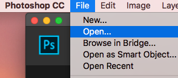
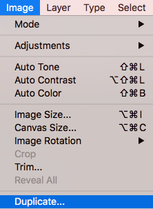
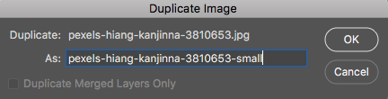
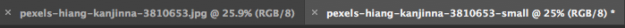
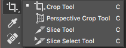

# Photoshop for Beginners Activity #1: Cropping and Saving Photos for Online Use
Let’s start with using Photoshop to crop and export a smaller version of a photo. If you have any questions, please ask!
 
1. Go to [PEXELS](https://www.pexels.com){:target="_blank"} and choose a photo to download. Click on the downward arrow icon on the image thumbnail, or if viewing the full image there will be a green Free Download button you can click on.
 
2. Open the photo in Photoshop by either clicking on the **Open button** or going to **File -> Open**. Find where you saved the photo and open it. If your browser automatically saved it for you, it is probably in your **Downloads** folder.
 
3. We are first going to make a copy of this image before we edit it so that we keep a full size copy of our original. To do this, click on Image in the top menu and then click on Duplicate. This will bring up a small window with the option to give the new copy a new name. It will save it to the same folder where the original is saved. Don’t worry about adding .jpg to the end of the file as this will be added for you. You will now see above your image that you have two tabs open in Photoshop with the names of the two files. Make sure you are working in the one you plan to resize. It’s best to  close the original to avoid confusion by clicking on the little  “x” next to the filename.

 
5. **Crop Tool**: 
 
  - Click on the **Crop tool** in the left toolbar (see right to see which other tools are in that group that might be on top). A crop window with a grid will appear over the photo and the crop options will show across the top of the software.
  - Clicking on the **Ratio dropdown** menu at the top, you can choose a specific aspect ratio to lock the crop, or you can leave it clear to freehand it. **Select 5 : 7**, the aspect ratio you would want if you were printing a 5x7 photo. Alternatively, you can choose a specific number of pixels or inches by selecting **W x H x Resolution** and typing in what you want: e.g.,  700 px by 460 px or 4 in by 6 in. (Tip: a 16 : 9 ratio is the common ratio for slide presentations and wide screen TVs.)
  - You can use the mouse to drag the crop window up and down to reposition it and drag the corners to resize the crop. The darker areas outside the window will be cropped out. When satisfied, **click on the check mark** in the top middle of the screen.
  - Click on **File -> Save** to save your recent changes.
5. **Exporting**: Here you have two options -- Exporting in a full size image (good for printing if the original was high enough resolution as in this example), and exporting in smaller file sizes which are better for sharing online. Follow Step A for the full size or Step B for the smaller size. Note: if you already cropped your image to a small pixel size, rather than a ratio, during the cropping portion of this activity, you will not need to save this image as a small file. 
  - To export this to a full size PNG file for printing, click on **File -> Export > Export As** in the upper left corner. A window will pop up with options for resizing. Leave image size and quality at 100%,  but make sure the **Format** is set to **PNG** in the dropdown in the upper right corner of the Export window. Click the **Export All** button in the bottom corner when ready. Another small window will pop up giving you an option to choose a save location. Choose a place on your computer to save the file and click **Save**.
  - To export this as a small file for web use, go through the same process as step A, but lower the pixels or scale and quality. On the right hand side, under File Settings, you can choose to decrease the number of pixels (Width and Height) or Scale. Notice that once you start making changes to any of those settings, it automatically adjusts the others to reflect the changes you’ve made. For this example, you can set either the Height or Width to 1000 pixels. On the left hand side you will see your file size change as you make changes. When you are finished, you will have the following files: the original unedited photo, a high quality print-size PNG, and a small web-size PNG.

[NEXT STEP: Basic Photo Edits](basic-edits.html){: .btn .btn-blue }
