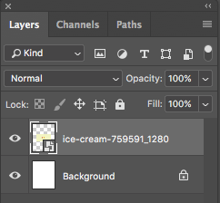

# Photoshop for Beginners Activity #3: Two Ways to Change Image Dimensions

In this activity we are going to change the aspect ratio of an image without cropping it so that we don’t lose any quality. The reason for showing you two ways is so you learn a couple of different useful skills in Photoshop while you do it. If you have any questions, please ask!

1. [Download this image for the exercise](https://pixabay.com/illustrations/ice-cream-drawing-pencil-759591/){:target="_blank"}
2. Open the photo in Photoshop by either clicking on the **Open button** or going to **File -> Open**. Find where you saved the photo and open it. If your browser automatically saved it for you, it is probably in your **Downloads** folder. 

3. **Duplicate**:
  - We are first going to make a copy of this image before we edit it so that we keep a copy of our original. To do this, click on Image in the top menu and then click on Duplicate. This will bring up a small window with the option to give the new copy a new name. It will save it to the same folder where the original is saved. Don’t worry about adding .jpg to the end of the file as this will be added for you. You will now see above your image that you have two tabs open in Photoshop with the names of the two files. Make sure you are working in the one you plan to edit. You can close the original to avoid confusion. 

 
4. **Changing Canvas Size**: 

  - Click on **Image -> Canvas Size**. This will pop up a window with Canvas Size options. For this example, we are going to turn this graphic from a rectangle into a square, so to do that, we will simply make sure that the lower number in Height pixels is changed to the same number as the **Width** by clicking in the box and typing. Your Photoshop may have this number in Pixels or in Inches, feel free to use the drop down to change it. The **Anchor** with the arrows below, shows you where your original image will be placed in relation to the new adjusted canvas size. With a centre anchor, the original image will be placed in the centre of the larger canvas. Once you’ve increased the Height, you can click OK.
src="images/3.6.png" style="float:right;width:100px" alt="color picker tool">  - The image will now have a bigger canvas size, but the stretched canvas will have a blank, white background. To match the background color, click on the **Color Picker** swatches at the bottom of the left toolbar (seen as the red square in the example on the right). This will bring up a **Color Picker** over the image with a little eyedropper tool. When you use that tool to click on the background colour, the Colour Picker will change to reflect the selected colour and you can then click OK.     - Next, click on the **Paint Bucket Tool** in the left toolbar. This may be hidden under the **Gradient Tool** (see right, below). Hover the **Paint Bucket Tool** over the white areas of the new canvas and then click. The colour you selected should fill in the whole white area. Do the same for the other white area.

  - You should now have a full, square image with a matching background. To save it, go to **File -> Save**. When a window pops up, click Save. Another window will pop up, click OK. 
 
5. **Placing an Image**:

  - For this second method, we will start with a blank canvas. Go to **File -> New**. A window will pop up with options for starting a new, blank document. Here you can choose the dimension necessary for your project. For this one, we are going to create a letter size image. Across the top of this window are tabs for **Photo, Print**, and other presets. **Click on Print**. This will open up a blank, white canvas in the dimensions of a letter size sheet of paper.
  - Click on **File -> Place Embedded** and then find the original image you downloaded, and then click Place. This will place the image in the centre of the canvas. Since the image we downloaded is not very high resolution, we will need to make it a bit smaller than this or it would print a bit pixelated. To do this, **hold down shift and drag one of the corners with the right mouse button at the same time**. Resize it to about half the size (see example) and then **release the shift key** and **drag it to the centre**. When you’re happy with the placement, **click on the check mark** at the top centre of the screen.
 
  - Next, go to the **Layers** panel at the right of the screen. **Click the lock** in the **Background** layer to unlock it. The name of the layer will change to Layer 0. 
The color in your **Color Picker** should still be selected from the background from the earlier steps, so you can just select the **Paint Bucket** again and hover over the white (make sure Layer 0 is selected) and click to paint the canvas with that color.
To save, follow the steps from the previous activities to **export the file** as a JPG or PNG. If you want to preserve the layers for future editing, you can save it as a PSD as well.  
 

[NEXT STEP: Templates and Smart Layers](smart-layers.html){: .btn .btn-blue }
