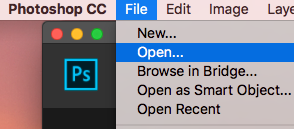
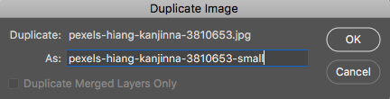
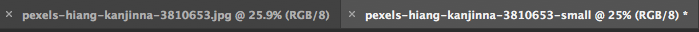
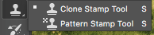

# Bonus Activity: Remove Something or Someone from a Photo
In a previous activity, we did a simple removal of simple, tiny objects but this activity will be about removing something a bit larger against a complex background. (Note: The larger and more intricate the object/person is, the more intertwined they are with the rest of the image, and the more complicated the background, the more difficult this process can be. Some situations will require advanced-level or professional-level skills. This activity gets you started with the basics.)
 
1. [Download the following image of person sitting in front of house]( https://bit.ly/3fxryHS){:target="_blank"}. Make sure to click on the green Download button to save the photo for this activity.

2. Open Photoshop and click on the **Open button** on the left, and navigate to where your downloaded image was saved. If your browser automatically saved it for you, it will likely be in your Downloads folder.
 
3. As we did in Activity #3, we are first going to make a copy of this image before we make major changes to it so that we keep a copy of our original. To do this, **click on Image** in the top menu and then **click on Duplicate**. This will bring up a small window with the option to give the new copy a new name. It will save it to the same folder where the original is saved. Don’t worry about adding .jpg to the end of the file as this will be added for you. You will now see above your image that you have two tabs open in Photoshop with the names of the two files. Make sure you are working in the one you plan to edit. You can close the original to avoid confusion by clicking the “**x**” next to the filename.
 
 
4. Photoshop will likely load the photo fairly small, so use the **Zoom** (magnifying glass icon) tool in the left toolbar to zoom into the photo so that you have a closer view of the person sitting in the grass. You’ll want to see most of the grass during the majority of this activity, but will need to zoom in closer at times. (Remember: to zoom in and out, you can change the Zoom tool to a Zoom Out tool by using the Tool Options menu across the top when the Zoom tool is selected. The magnifying glass with the + is Zoom In and - is Zoom Out. You can quickly jump to viewing the whole photo by clicking on Fit Screen.)
 
5. Before editing the layer, we will need to make a copy of it. To do this, go to the **Layers panel** on the right.(If this is not visible, you can go to Window in the top menu and make sure Layers is checked.) **Right click on the Background layer** and click **Duplicate Layer**. This will bring up a window with the option to give the new duplicate layer a name. **Type in a name** and **click OK**.

6. Make sure your new layer is selected in the Layers panel and then go to the toolbar on the left and **click on the Lasso Tool**. This tool allows you to select an area using freehand drawing. **Use your mouse to draw closely around the person** without touching the edges until you get all the way around, while keeping the mouse button held down the whole time. As soon as you let go of the mouse button, the end of the selection line will connect with the other end to create a closed area. If you accidentally let go too soon, this will result in the selection cutting through your subject (see example). To deselect and start over, click on **Select** in the top menu and then click **Deselect**, and then try again. This may take some practice until you get a selection you are happy with. Feel free to take your time moving the mouse around the subject. 

7. Once fully selected, go up to the top menu and click on **Edit** in the top menu and then click on **Fill**.  This will bring up a small box with Fill options. Change Contents to **Content Aware and deselect the Color Adaptation check box**. Click **OK**.
8. If you’ve selected similar to this example you should get similar results to the right. Go ahead and go to **Select** in the top menu and **click on Deselect**. 
 
9. From here we will do some fine tuning. Because of the rough and patchy nature of this hillside, it will not need much since our eyes already expect it to look uneven. You can go over to the **Layers panel** on the right and **click on the eye** next to your editing (newer) layer to hide it and reveal the original Background layer behind it to see the before and after difference. 
 
10. Zooming in slightly, we can see that some of the fill looks blurrier than the grass next to it, and then some of the fill looks closer than the grass next to it. In both cases, the Content-Aware Fill tool guessed incorrectly, so we need to replace those patches so they match the areas they are near.

11. **Click on the Clone Stamp tool** in the left toolbar menu. In the upper tool options menu you can **click on the dropdown arrow next to the white dot** to bring up Size and Hardness options. For this example, setting the size close to 100px and the Hardness to around 65% should be good.

12. To use the Clone Stamp tool, make sure your editing layer is selected and visible. Find a patch of the image you want to use to stamp over the unsuitable part, and, **while holding down the Alt key, click on it with your mouse**. This marks that part of the image as the part to be cloned. Next **click on the part you want to cover up**. (In the example to the right, a section of the rock was cloned and is now inside the Clone Stamp tool, hovering over a section of the grass, ready to be stamped.) Once you stamp it, the stamp tool will not simply stamp the same object again, but build out from the same spot. What you’ll want to be careful about is avoiding repeating patterns (e.g., a bunch of the same flower stamped over and over in the same area). You can zoom out and select a sample from a somewhat neutral area with similar lighting from the same plane of focus and then zoom back in to stamp in the area you want to cover up. This process takes much time and practice to get a natural look. You are essentially painting in replacement grass and flowers using samples from other parts of the image.

   <button onclick="toggle('gif2')">Show/Hide Animation</button>
   

   
   

   
13. When you practice with other images, you may find you need to use different settings with the Clone Stamp to achieve better results. Feel free to experiment and remember that making lots of mistakes is part of the learning process. The more advanced levels of this type of work is something that people generally pay professionals to do and can take a very long time to master. Step 15 has some links to more images to practice with.

14. Examples of images that would be difficult to remove the person from and the reasons why:
    - [At first glance, this one looks like it wouldn’t be too bad, but one of the biggest challenges would be to convincingly recreate the tree trunks behind the person](https://www.pexels.com/photo/person-walking-in-foggy-forest-3354172/){:target="_blank"}
    - [This one looks deceptively simple, but once the person is removed, the sharp-edged shadow they are casting must also be removed from the rocks]( https://www.pexels.com/photo/rear-view-of-man-sitting-on-rock-by-sea-307008/){:target="_blank"} 

15. Here are some good images to practice on:
    - [Image 1](https://www.pexels.com/photo/landscape-mountains-nature-sky-104347/){:target="_blank"} This one has a sign instead of a person
    - [Image 2](https://www.pexels.com/photo/person-in-blue-jacket-and-black-pants-standing-on-rock-near-waterfalls-3608618/)
    - [Image 3](https://www.pexels.com/photo/man-wearing-red-jacket-doing-peace-sign-3225529/){:target="_blank"}

[NEXT STEP: Earn a Workshop Badge](informal-credentials.html){: .btn .btn-blue }
